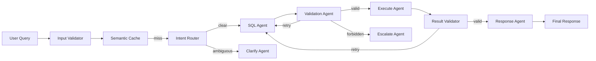

# 🚀 Datavox

**Intelligent Agentic Data Assistant** — Give voice to your data. Ask questions in natural language, get validated SQL and clear insights.

Datavox uses a **LangGraph multi-agent pipeline** with 6 specialized agents to route, generate, validate, execute, and explain SQL queries against your database.

---

## ✨ Features

- **Natural Language to SQL** — Ask questions like *"What are the top 5 customers by total spend?"* and get accurate SQL + human-friendly analysis
- **Multi-Agent Pipeline** — Intent Router → SQL Agent → Validation Agent → Execute Agent → Result Validator → Response Agent
- **Multi-Table Upload** — Drag & drop CSV/JSON files with automatic foreign key relationship detection
- **Database Explorer** — Browse tables, view schemas with PK/FK badges, and inspect live data
- **Bring Your Own Key (BYOK)** — Users provide their own Gemini or OpenAI API key (stored only in their browser)
- **RAG-Powered Schema Retrieval** — Embedding-based schema matching for accurate query generation
- **Security Hardened** — Prompt injection guard, SQL mutation blocking, rate limiting, identifier validation

---

## 🏗️ Architecture



### Agent Pipeline

| Agent | Role |
|-------|------|
| **Intent Router** | Classifies query as data question or needs clarification |
| **SQL Agent** | Generates SELECT query from natural language + schema context |
| **Validation Agent** | Blocks forbidden SQL (DROP/INSERT/ALTER), checks semantic alignment |
| **Execute Agent** | Runs validated SQL against SQLite/PostgreSQL |
| **Result Validator** | Verifies output meaningfully answers the user's question |
| **Response Agent** | Synthesizes conversational natural language response |

---

## 🚀 Quick Start

### Prerequisites
- Python 3.11+
- A **Google Gemini API Key** (free from [Google AI Studio](https://aistudio.google.com/app/apikey)) or **OpenAI API Key**

### Setup

```bash
# Clone the repository
git clone https://github.com/sunil276/langgraph-project.git
cd langgraph-project

# Create virtual environment
python -m venv .venv
.venv\Scripts\activate  # Windows
# source .venv/bin/activate  # Mac/Linux

# Install dependencies
pip install -r requirements.txt

# Configure environment
cp .env.example .env
# Edit .env and add your GEMINI_API_KEY

# Seed sample database
python scripts/init_sample_db.py

# Start the server
uvicorn server:app --host 127.0.0.1 --port 8000
```

Open **http://127.0.0.1:8000** in your browser.

---

## 🔑 API Key Configuration

Datavox supports two modes:

1. **Server-level key** — Set `GEMINI_API_KEY` in your `.env` file (all users share this key)
2. **Bring Your Own Key** — Click the ⚙️ **API Key** button in the UI header. Your key is stored in `localStorage` and sent as an `X-Datavox-Api-Key` HTTP header per request. Never logged or stored server-side.

---

## 📊 Sample Data

Datavox ships with 4 pre-seeded tables:

| Table | Rows | Description |
|-------|------|-------------|
| `customers` | 20 | Customer profiles with names, emails, cities |
| `products` | 15 | Product catalog with prices and categories |
| `orders` | 30 | Order records linked to customers and products |
| `regional_sales` | 20 | Regional revenue data by quarter |

### Example Queries
- *"Show top 5 customers by total order value"*
- *"What is the average product price by category?"*
- *"Which region had the highest revenue in Q1?"*
- *"List all orders placed in the last 30 days"*

---

## 🛡️ Security

| Layer | Protection |
|-------|-----------|
| **Input Validator** | Min/max length, type checking |
| **Prompt Guard** | 20+ regex patterns for prompt injection + SQL attacks |
| **Validation Agent** | Blocks `DROP/DELETE/INSERT/UPDATE/ALTER/CREATE/GRANT/REVOKE` |
| **Identifier Validation** | Strict `^[a-z][a-z0-9_]{0,63}$` regex for all table/column names |
| **Rate Limiting** | 10 requests/minute per IP on `/api/chat` (slowapi) |
| **Upload Limits** | 10MB max per file |
| **CORS** | Restricted to configured origins in production |
| **Context Isolation** | Request-scoped API key context vars with middleware reset |

---

## ☁️ Deployment (Render)

See [DEPLOYMENT.md](DEPLOYMENT.md) for full instructions.

**Quick version:**
1. Push to GitHub
2. Go to [Render Dashboard](https://dashboard.render.com) → New → Blueprint
3. Connect your repo — Render auto-detects `render.yaml`
4. Click Apply → Live in ~2 minutes

---

## 🧪 Testing

```bash
pytest -v
```

**40 tests** covering agents, edges, pipeline E2E, input validation, SQL validation, server API, and SQLite execution.

---

## 📁 Project Structure

```
├── agents/              # LangGraph agent nodes
│   ├── intent_router.py
│   ├── sql_agent.py
│   ├── validation_agent.py
│   ├── execute.py
│   ├── result_validator.py
│   ├── response.py
│   └── terminal_node.py
├── api/                 # Input validation
├── config/              # Settings & LLM configuration
├── db/                  # Database connection & seeding
├── graph/               # LangGraph state, edges, builder
├── rag/                 # Schema indexer & retriever
├── security/            # Prompt injection guard
├── services/            # Data ingestion service
├── static/              # Frontend (HTML/CSS/JS)
├── tests/               # 40 unit & integration tests
├── server.py            # FastAPI web server
├── main.py              # Pipeline entry point
├── schema.json          # Table schema registry
├── Dockerfile           # Production container
├── render.yaml          # Render deployment blueprint
└── DEPLOYMENT.md        # Deployment guide
```

---

## 📝 License

MIT
